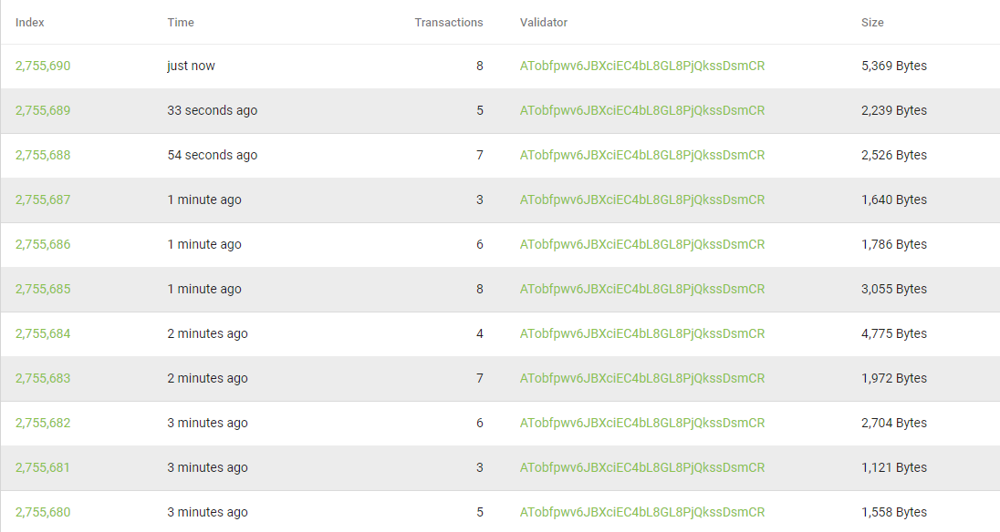

# Consensus Nodes

The consensus nodes monitoring is made by NEO and you can check the publics informations right [here](https://neo.org/consensus).

The consensus nodes informations are mostly private, for example you cannot know the ipaddress of the consensus nodes because of security issues.


## What they do?

They are responsibles for accepiting new data inside the blockchain, so every Consensus check the information that one of them is trying to send to the network and evaluate if it's right or not.

In this process they chose the next consensus node and the life goes on.

Now a days the Consensus node is not an RPC node!!!

Below you can see the policy of the network:
```json
{
  "PluginConfiguration": {
    "MaxTransactionsPerBlock": 500,
    "MaxFreeTransactionsPerBlock": 20,
    "BlockedAccounts": {
      "Type": "AllowAll",
      "List": []
    }
  }
}
```

The code can be found [here](https://github.com/neo-project/neo-plugins/blob/master/SimplePolicy/SimplePolicy/config.json)

From that policy you can see some restrictions the consensus nodes have to finish a block, and the most interesting part is the free transactions limit. There is only **20**!!

## OBS

May you have seeing the block information on a blockchain explorer and saw something like this:

 

 Did you find that is very wierd that all the blocks have the same validator?
 Look like NEO blockchain is centralized!!!

 **Relax**, for kept the address of the consensus nodes anonimous they use the multisignarure, so the validator address is the multisignature address ( a Smart Contract itself ) that represents all the validatons inside the same address!!!

[Back](../Network.md)