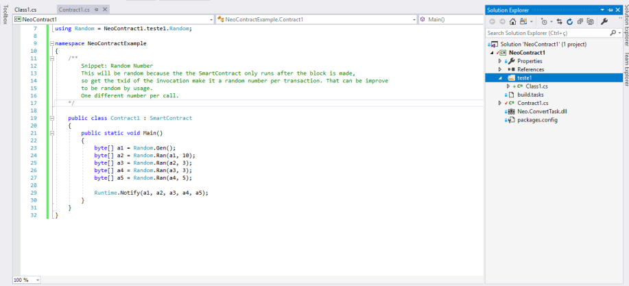

# Introduction

## C#

### Methods

The Main method is the entry point of the smart contract, and it must be static!

For you to split the Smart Contract into multiple functions it must be static too!!

See the example below:

 - Just the main Function:

```CSharp
using Neo.SmartContract.Framework;
using Neo.SmartContract.Framework.Services.Neo;
using System;
using System.Numerics;
namespace NeoContract1
{
    public class Contract1 : SmartContract
    {
        public static void Main()
        {
            String test1 = "Test";
        }
    }
}
```

 - Splited into 2 methods:

```CSharp
using Neo.SmartContract.Framework;
using Neo.SmartContract.Framework.Services.Neo;
using System;
using System.Numerics;
namespace NeoContract1
{
    public class Contract1 : SmartContract
    {
        public static void Main()
        {
            String test1 = GetString();
        }

        public static String GetString()
        {
            return "Test";
        }
    }
}
```

### Classes

If you're interested in create multiple classes to better develop your Smart Contract, you can do it as follows:

```CSharp
using Neo.SmartContract.Framework;
using Neo.SmartContract.Framework.Services.Neo;
using Neo.SmartContract.Framework.Services.System;
using System;
using System.Numerics;

namespace NeoContractExample
{
    public class Random: SmartContract
    {
        public static byte[] Ran(byte[] salt, int size = 1) {
            Transaction tx = (Transaction)ExecutionEngine.ScriptContainer;
            Header bl = Blockchain.GetHeader(Blockchain.GetHeight());
            return Hash256(bl.Hash.Concat(tx.Hash).Concat(salt)).Range(0, size);
        }
        public static byte[] Gen(int size = 1) {
            byte[] zero = new byte[0];
            return Ran(zero,size);
        }
    }

    public class Contract1 : SmartContract
    {
        public static void Main()
        {
            byte[] a1 = Random.Gen();
            byte[] a2 = Random.Ran(a1, 10);
            byte[] a3 = Random.Ran(a2,3);
            byte[] a4 = Random.Ran(a3,3);
            byte[] a5 = Random.Ran(a4,5);
            
            Runtime.Notify(a1,a2,a3,a4,a5);
        }
    }
}

```


## Python

Since python does not need to set the type of the variable, the smart contract is very simple and the same we did on C# can be done on python.

### Methods

- Using only the main method:

```Python
from boa.interop.Neo.Runtime import Notify, CheckWitness

def Main():
    #OWNER=b'031a6c6fbbdf02ca351745fa86b9ba5a9452d785ac4f7fc2b7548ca2a46c4fcf4a'
    OWNER=b'\x03\x1alo\xbb\xdf\x02\xca5\x17E\xfa\x86\xb9\xbaZ\x94R\xd7\x85\xacO\x7f\xc2\xb7T\x8c\xa2\xa4lO\xcfJ'
    result = CheckWitness(OWNER)
    if result:
        print("OWNER is caller")
        return True
    return False               
```

 - Splitting it into 2 methods:

```Python
from boa.interop.Neo.Runtime import Notify, CheckWitness

OWNER=b'\x03\x1alo\xbb\xdf\x02\xca5\x17E\xfa\x86\xb9\xbaZ\x94R\xd7\x85\xacO\x7f\xc2\xb7T\x8c\xa2\xa4lO\xcfJ'

def Test1():
    return CheckWitness(OWNER)

def Main():
    if Test1():
        print("OWNER is caller")
        return True
    return False
```

### Classes

It's not possible to split the python code into multiple classes!!


## Obs

Both, C# and Python, can be splitted into multiple files.

### C#

The image below shows an visual studio project with multiple classes and files:

 

### Python

Since you cannot split it into multiple classes,you can split the constants and methods of your SC into multiple files as you can see [here](https://github.com/neonexchange/neo-ico-template/tree/master/nex)

It's an example of python code and it splits the methods and the constans into multiple files!!


[Back](../SmartContract.md)